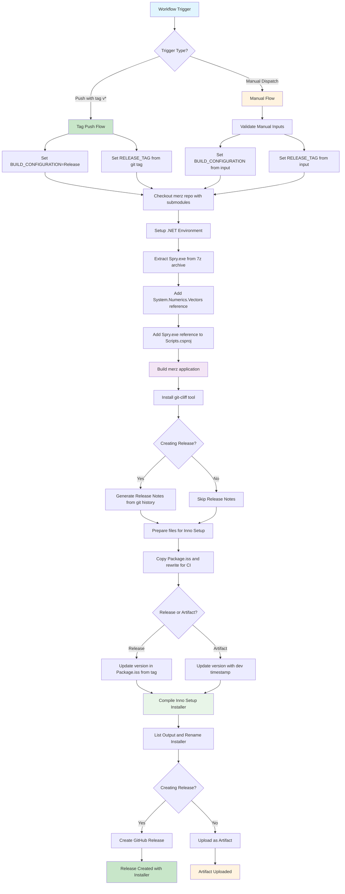

# merz
Mining Consulting Tooling

Welcome to the MERZ package; a set of tools tailored for mining engineers.
MERZ is designed as a set of 'plugins' for the Spry scheduling software, although
this is not a hard limitation.

The tool set is used internally by Precision Mining, and is available for general use with
regular updates at the [Releases](https://github.com/precision-mining-consulting/merz/releases) page.

## How to get it

MERZ should be downloaded from the releases page. This page should be checked regularly for updates.
Once the installer has been downloaded, run the installer to install the binary in the default location.
You may need administrator privileges.

To use the tooling, a script is required within a Spry model. This script is packaged with the installer.

1. Import a **Single Script** from the MERZ installation folder (typically `C:\Users\<user>\AppData\Local\Programs\merz\MERZ.cs`)

<p align="center">

<br>
<em>Use <code>%APPDATA%</code> to quickly navigate to AppData folder</em>
</p>

<p align="center">

<br>
<em>Navigate up one level to the AppData folder</em>
</p>

<p align="center">

<br>
<em>Proceed to navigate to the typical merz installation folder</em>
</p>

<p align="center">

<br>
<em>Select the <code>Merz.cs</code> C# script</em>
</p>

2. After recompiling scripts, there will be a `Merz->Open()` script entry point:

<p align="center">

</p>

3. Running this script (should) open a dialogue with various tools available (your dialogue may look a little different):

<p align="center">

</p>

## Working with Submodules

This repository uses Git submodules to manage dependencies and external tools. Here's how to work with them:

### 1. How to Clone

When cloning the repository for the first time, you need to include the submodules:

```bash
# Clone the repository with submodules
git clone --recursive https://github.com/precision-mining-consulting/merz.git

# Or if you've already cloned without submodules, initialize them:
git submodule init
git submodule update
```

### 2. Update Submodules

To update all submodules to their latest versions:

```bash
# Update all submodules to their latest commits
git submodule update --remote

# Or update a specific submodule
git submodule update --remote pm-spry-tools
```

### 3. Make Commits to Submodules and Update Parent Repo

When working with submodules, you need to commit changes in both the submodule and the parent repository:

```bash
# 1. Navigate to the submodule directory
cd pm-spry-tools

# 2. Create and checkout a new feature branch
git checkout -b feature/your-feature-name

# 3. Make your changes and commit them
git add .
git commit -m "Your commit message"
git push origin feature/your-feature-name

# 4. Go back to the parent repository
cd ..

# 5. Create and checkout a new feature branch in the parent repo
git checkout -b feature/update-submodule

# 6. Update the parent repository to point to the new submodule commit
git add pm-spry-tools
git commit -m "Update submodule to latest version"
git push origin feature/update-submodule
```

### 4. Check Git LFS Files

This repository uses Git LFS (Large File Storage) for large files. To ensure LFS files are properly tracked:

```bash
# Check if Git LFS is installed
git lfs version

# Install Git LFS if not already installed
# Windows: Download from https://git-lfs.com/

# Track LFS files (if not already configured)
git lfs track "*.7z"


# Check which files are being tracked by LFS
git lfs track

# Pull LFS files
git lfs pull

# Check LFS file status
git lfs ls-files
```

**Note**: Make sure you have Git LFS installed and configured before working with this repository to avoid issues with large files.

## Build and Release Workflow

The `pm-spry-tool` submodule repository uses GitHub Actions to automatically build the Merz application installer and create releases. The workflow can be triggered automatically by pushing tags or manually through the GitHub Actions interface.

### Triggers

#### 1. Automatic Release (Tag Push)
Push a version tag to automatically trigger a release build:

```bash
git tag v1.2.3
git push origin v1.2.3
```

**What happens:**
- Builds in `Release` configuration
- Generates release notes using git-cliff
- Creates a GitHub release with the installer attached
- Installer filename: `merz-installer-v1.2.3-Release.exe`

#### 2. Manual Trigger (Workflow Dispatch)
Manually trigger the workflow from the GitHub Actions tab with custom options.

**Required Inputs:**
- **Build Configuration**: `Debug` or `Release`
- **Create GitHub Release**: `true` or `false`

**Optional Inputs:**
- **Release tag**: Required if creating a release (e.g., `v1.2.3`)
- **Release title**: Custom title for the release (auto-generated if empty)

### Usage Examples

#### Development Build (Artifact Only)
Use this for testing builds without creating a release:

1. Go to **pm-spry-tools** repository → **Actions** → **Build and Release Merz Installer**
2. Click **Run workflow** on the right
3. Configure the workflow:
   - **Branch**: Select the branch you want to build from
   - **Build Configuration**: Choose `Debug` or `Release`
   - **Create GitHub Release**: Leave unchecked (`false`)
   - **Release tag**: Leave empty (not required for artifact builds)
   - **Release title**: Leave empty (not used for artifact builds)
4. Click **Run workflow**

**Result:** Installer uploaded as GitHub Actions artifact (30-day retention)

#### Manual Release
Use this to create a release from any branch:

1. Go to **pm-spry-tools** repository → **Actions** → **Build and Release Merz Installer**
2. Click **Run workflow** on the right
3. Configure the workflow:
   - **Branch**: Select the branch you want to build from
   - **Build Configuration**: Choose `Release` (recommended for releases)
   - **Create GitHub Release**: Check this box (`true`)
   - **Release tag**: Enter version tag (e.g., `v1.2.3` - must start with 'v')
   - **Release title**: Optional custom title (auto-generated if empty)
4. Click **Run workflow**

**Result:** GitHub release created with installer attached + installer also available as artifact

#### Important Notes:
- **Artifacts are always created** regardless of whether a release is created or not
- **Check previous releases** to determine the next version number for release tags
- **Development builds** are available as downloadable artifacts from the workflow run page
- **Release builds** are available both as GitHub releases and as artifacts

### Prerequisites

The workflow requires:
- **SPRY_ARCHIVE_PASSWORD**: Secret containing password for the Spry archive
- **RELEASES_REPO_TOKEN**: Token with permissions to create releases in the merz repository

### Output Files

#### Release Builds
- **Location**: GitHub Releases page
- **Filename**: `merz-installer-{version}-{config}.exe`
- **Example**: `merz-installer-v1.2.3-Release.exe`

#### Artifact Builds
- **Location**: GitHub Actions artifacts
- **Filename**: `merz-installer.exe` (in artifact named `merz-installer-{config}-{branch}`)
- **Retention**: 30 days

### Release Notes

Release notes are automatically generated using git-cliff from the `pm-spry-tools` repository commits between the previous and current release tags.

### Workflow Diagram

The following diagram illustrates the complete build and release workflow:

<p align="center">

<br>
<em>Build and Release Workflow Process</em>
</p>



### Troubleshooting

#### Common Issues:
1. **Missing SPRY_ARCHIVE_PASSWORD**: Workflow will fail at Spry extraction step
2. **Invalid release tag**: Manual releases require tags starting with 'v'
3. **Missing RELEASES_REPO_TOKEN**: Release creation will fail

#### Build Artifacts:
All builds create an installer, but only releases make it publicly available. Development builds are available as downloadable artifacts from the workflow run page.

## Support

**MERZ is unsupported**. The tools are actively maintained by Precision Mining, since they are in frequent use internally,
but they are released with **NO WARRANTY** for general use.
It also should be mentioned that running the tools is at the user's own risk.

We encourage users to report bugs through the [issue tracker](https://github.com/precision-mining-consulting/merz/issues),
and feature requests will be actively considered.
Documentation for the tooling is currently sparse, with a goal to improve this.
Any exceptions or errors will be dumped to the Output panel, this is a good place to start.
